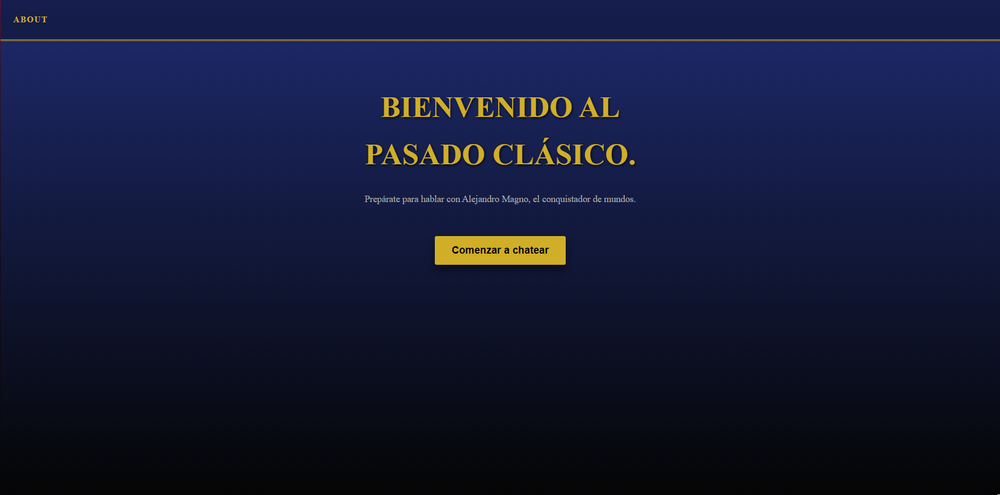
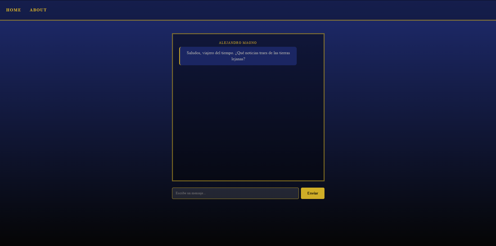
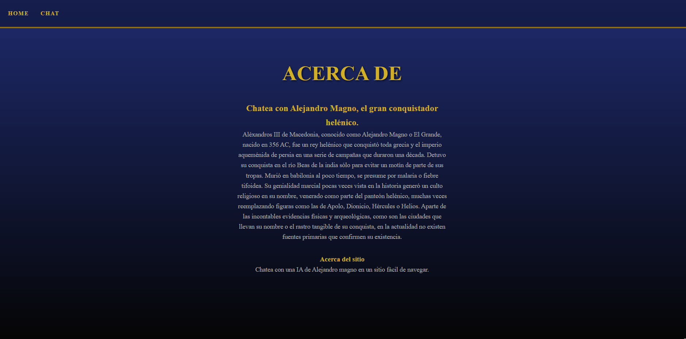

# Chatea con Alejandro Magno

Una Single Page Application (SPA) que te permite viajar en el tiempo y conversar con uno de los conquistadores más grandes de la historia, utilizando la API de Google Gemini (modelo 2.5 Flash).

## 👑 Sobre el Personaje: Alejandro Magno
El asistente virtual asume la identidad de **Alejandro Magno**, Rey de Macedonia, Hegemón de la Liga de Corinto y Faraón de Egipto. El objetivo de la IA es interactuar desde una perspectiva histórica precisa, combinando la autoridad implacable de un soberano con la aguda curiosidad de un filósofo. Las respuestas reflejan nobleza y están enriquecidas con metáforas tácticas, militares y filosóficas propias de la era clásica.

## 🚀 Requisitos y Ejecución Local

### 1. Instalar Dependencias
Asegúrate de tener [Node.js](https://nodejs.org/) instalado. Clona el repositorio y ejecuta el siguiente comando en la raíz del proyecto para instalar las dependencias necesarias (`@google/generative-ai`, `vitest`, `jsdom`):
```bash
npm install
```

### 2. Configurar Variables de Entorno (`.env`)
Crea un archivo llamado `.env` en la raíz de tu proyecto. Necesitarás una clave de API de Google Gemini. Añade la siguiente línea al archivo:
```env
GEMINI_API_KEY=tu_clave_de_api_aqui
```

### 3. Ejecutar con Vercel Dev
Ya que la aplicación utiliza Vercel Serverless Functions (en `api/chat.js`) para manejar las peticiones a la API de forma segura sin exponer tu llave al cliente, debes ejecutar el proyecto usando Vercel CLI. 

Si no tienes Vercel CLI instalado globalmente, instálalo con:
```bash
npm i -g vercel
```
Luego, inicia el servidor de desarrollo:
```bash
vercel dev
```
El proyecto estará disponible usualmente en `http://localhost:3000`.

## 🧪 Cómo Ejecutar los Tests
El proyecto utiliza **Vitest** para las pruebas unitarias (ubicadas en `tests/api/chat.test.js` y `tests/src/views/chat.test.js`). Para ejecutar la suite de pruebas, simplemente corre:
```bash
npm test
```

## ☁️ Cómo Desplegar a Vercel

### Opción 1: Desde Vercel CLI
1. Ejecuta el comando `vercel` en tu terminal e inicia sesión.
2. Sigue las instrucciones para enlazar tu proyecto local con Vercel.
3. Una vez configurado, despliega a producción con:
   ```bash
   vercel --prod
   ```

4. **Importante:** Recuerda ir al panel de control de tu proyecto en la web de Vercel (Settings > Environment Variables) y agregar tu variable `GEMINI_API_KEY` para que la IA funcione en producción.

### Opción 2: Desde el Dashboard de Vercel (GitHub/GitLab)
1. Sube tu código a un repositorio en GitHub.
2. Ve a [Vercel](https://vercel.com/) y haz clic en "Add New..." > "Project".
3. Importa tu repositorio.
4. En la sección "Environment Variables", añade la clave `GEMINI_API_KEY` y su valor correspondiente.
5. Haz clic en "Deploy".

### 5. 📸 Capturas de Pantalla

*Vista Home:*


*Vista Chat:*


*Vista About:*


## 🔗 Link a la Aplicación Desplegada
Puedes probar la aplicación en vivo aquí: **[https://proyecto-m3-daniel-inostroza.vercel.app](https://proyecto-m3-daniel-inostroza.vercel.app)**

