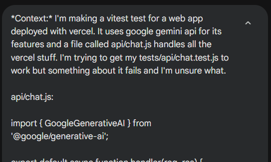
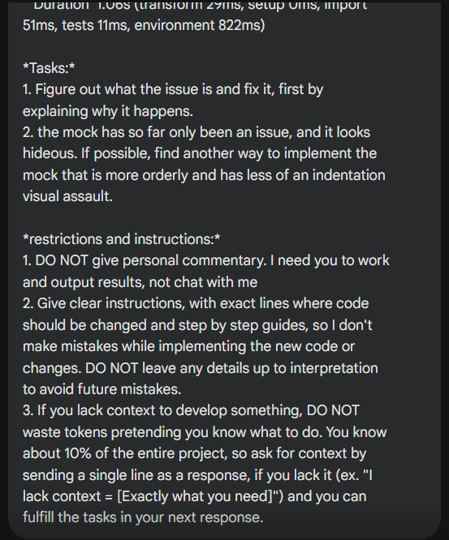
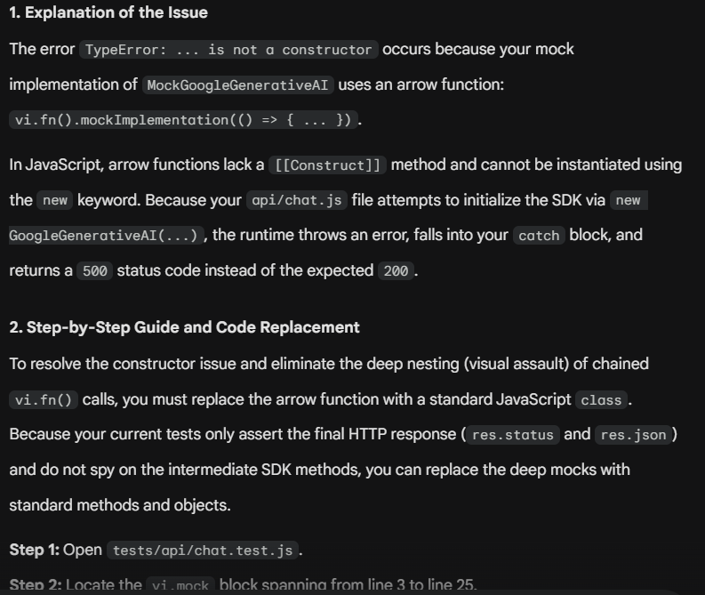

# Este documento está escrito sin uso de IA.

En este proyecto usé exclusivamente Gemini.
La IA fue esencial para integrar conceptos vistos en las lectures en el formato en el que estaba construyendo mi proyecto, ya que el código que se ve ahí rara vez funciona simplemente copiando y pegando.

### Mis prompts seguían esta estructura:
```
Contexto: Aquí le enviaba un párrafo corto con el contexto que era necesario y el problema a resolver (ej. Estoy haciendo una página SPA deployada en Vercel...)
-src/views/chat.js:
 [Aquí procedía a mandar el código relevante al problema junto a todo el contexto necesario]

Tarea: Aquí se le enviaba a la IA exactamente el problema que debía resolver, ya que el contexto la podía desviar. (ej. "Mi view de /about no se dibuja en el DOM. 1. explica por qué sucede esto. 2. resuelve el problema dando al menos dos soluciones distintas")

Instrucciones y restricciones: En esta última parte se le da a la IA la forma en la que debe responder, ej:
  1. Explica el bug y toda la información relevante acerca de por qué sucede.
  2. Un paso a paso para implementar tu fix con números de líneas exactos y sin dejar nada a interpretación.
  3. No me des opiniones ni comentarios personales. No busco chatear, busco resultados.
  4. Sigue la siguiente estructura en tu respuesta:
    A. Explicación del Bug
    B. Paso a paso de cómo implementar los cambios
    C. Listado completo de cambios y argumentos de por qué lo hiciste así
    D. (opcional) comentarios extra e información importante que no cabe en las otras secciones
  5. En caso de que te falte contexto para realizar esta tarea, no pretendas saber ya que solo conoces el 10% de mi proyecto. Ahorrate los tokens y responde exactamente con "Requiero contexto: [Exactamente lo que te falta]" y resuelves la tarea en tu siguiente respuesta.
```

Esta estructura bien formateada garantizaba que la IA me enviara siempre exactamente lo que yo buscaba. Dos minutos haciendo un buen prompt garantizaba incontable tiempo en el futuro sin tener que volver a buscar información en chats llenos de muros de texto que en cientos de palabras no dicen nada, aparte que la estructura y "bloques" de prompts se pueden guardar en un archivo .txt simple para copiar y pegar formatos que funcionan consistentemente.

**Ejemplos**
 


<small>En este prompt se le enviaron los archivos "tests/api/chat.test.js", "api/chat.js" y el log de error completo.</small>



<small>Se ve como se le especifica exactamente su tarea y las restricciones</small>



<small>Responde en el formato solicitado sin llenar mi pantalla con un muro de texto sin información substancial</small>

## Conclusión

Si bien la IA tiende a adelantarse y darnos código que muchas veces no entendemos, al usar prompts con esta estructura podemos investigar y estudiar las soluciones que nos da en profundidad antes de implementar lo que propone. No solo eso, en conversaciones largas tiende a alucinar muchisimo menos y ser mas consistente en el tiempo, lo cual nos quita la necesidad de tener que darle el contexto en una conversación distinta cada vez que queremos implementar un cambio nuevo.
Esta herramienta, a pesar de ser fácil de usar, lleva tiempo y cierto nivel de frustración aprender a usarla y que te entregue exactamente lo que buscas. En mi caso, nunca me ha gustado que responda creyendose mi amiga o que me llene la pantalla de palabras cuando yo solo buscaba un sí o un no, o en el caso del desarrollo, solo quiero que me de el código y su razonamiento o explicación de las tecnologías usadas, no me interesa que me quite poder mental con un párrafo haciendose la graciosa.